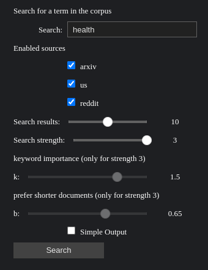

# Google2

## Description

A simple search engine that uses 3 different search algorithms to find the best results for the user :
1. **TF** : Basic Term Frequency
2. **TF-IDF** : Term Frequency-Inverse Document Frequency
3. **BM25** : Best Matching 25

## Installation

1. Clone the repository
2. Run the following command to install the required packages:
```bash
pip install -r requirements.txt
```
3. Run the following command to start the juptyer notebook:
```bash
jupyter notebook
```
4. Open the `interface.ipynb` file and run the cells to see the results.

## Usage

You will see the following interface:



1. Enter the query in the text box.
2. Select the search algorithm strength.
3. Click on the `Search` button to see the results.

You can also exclude sources from the search by unchecking the concerned checkboxes.

When in simple output mode,
the results will be displayed in a simplified table with only the body and the score of the document.

## Tweaking

### Search Algorithm Strength

When in BM25 mode (strength 3),
you can tweak the parameters of the algorithm by changing the values of the following variables:

1. `k` : The term frequency saturation parameter
2. `b` : The length normalization parameter

I'd recommend keeping the default values for the best overall results, but feel free to experiment with them.

### Corpus

by default,
the corpus is constructed from reddit and arxiv post using the SUBJECTS variable in the first cell of the notebook.

You can change the value of this variable to a list of any other subreddit or arxiv category
to get results from different sources.

## License

This project is licensed under the [GNU General Public License v3.0](https://www.gnu.org/licenses/gpl-3.0.en.html).

## Authors

- [**Mathieu Ponal**](https://github.com/TxMat)
- [**Hossein Abdoli**](https://github.com/ABDOLI-Hossein)